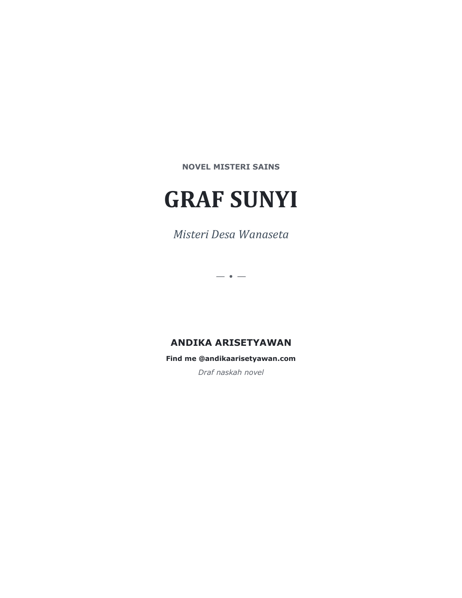

# Graf Sunyi: Misteri Desa Wanaseta

  

**Novel misteri sains** karya **Andika Arisetyawan**.

📖 **Baca online:** <https://andikaarisetyawan.com/novel_1/>
📄 **Unduh PDF:** [Graf_Sunyi_Misteri_Desa_Wanaseta.pdf](Graf_Sunyi_Misteri_Desa_Wanaseta.pdf)

## Sinopsis

Di Desa Wanaseta, sesuatu yang belum dipahami tidak pernah dibiarkan tanpa nama.
Bunyi dari dalam sumur disebut tangisan; embusan udara dari rongga batu disebut
napas penunggu. Suatu malam berkabut, Rukman — penjaga arsip desa — mendengar
namanya dipanggil dari radio tua yang tidak berbaterai. Sebelum fajar, ia
menghilang, membawa serta peta saluran air tahun 1978.

Tiga orang datang untuk mencari jawab: **Laras** membaca tubuh melalui ilmu
kedokteran, **Bima** membaca hubungan melalui matematika, dan **Nara** membaca
jejak melalui teknologi. Mereka tidak datang untuk menertawakan kepercayaan
warga, melainkan untuk bertanya: bagian mana yang merupakan gejala medis,
bagian mana yang membentuk pola, bagian mana yang meninggalkan sinyal — dan
bagian mana yang sengaja dimanfaatkan oleh manusia?

## Tentang situs ini

Situs baca dibangun sebagai halaman statis *offline-first*:

- [`index.html`](index.html) — reader satu berkas (HTML + CSS + JS inline):
  sampul, navigasi halaman, zoom, pencarian teks, mode gelap/terang, dan
  penyimpanan posisi baca terakhir di `localStorage`.
- [`pdfjs/`](pdfjs/) — [PDF.js](https://mozilla.github.io/pdf.js/) v6.1.200
  (Mozilla, lisensi Apache-2.0) yang di-vendor lokal — tanpa CDN.

## Hak cipta

© 2026 Andika Arisetyawan. Seluruh hak cipta atas naskah *Graf Sunyi: Misteri
Desa Wanaseta* dilindungi undang-undang. Naskah ini adalah draf dan
dipublikasikan untuk dibaca secara pribadi; dilarang memperbanyak,
mendistribusikan ulang, atau mengubah sebagian maupun seluruh isinya tanpa izin
tertulis dari penulis. Kontak: [andikaarisetyawan.com](https://andikaarisetyawan.com).

PDF.js disertakan sesuai ketentuan lisensinya — lihat [`pdfjs/LICENSE`](pdfjs/LICENSE).
